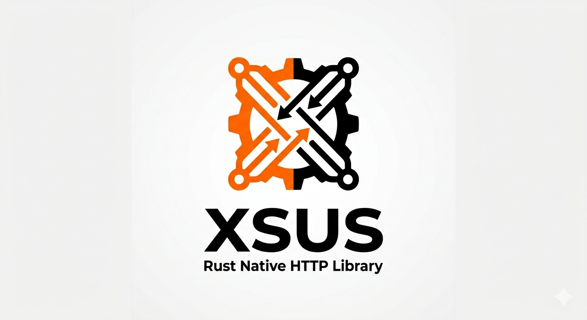

  

### Work In Progress 
**xsus** is a native HTTP client library built from scratch in Rust. 

It is currently in **active development** and is not yet functional for networking tasks. I am building this step by step to ensure a zero-dependency, high-performance architecture. 

**Current State:**
- [x] HTTP/1.1 Request structure and string generation.
- [x] Robust Response Parsing (Status, Headers, and Body state-management).
